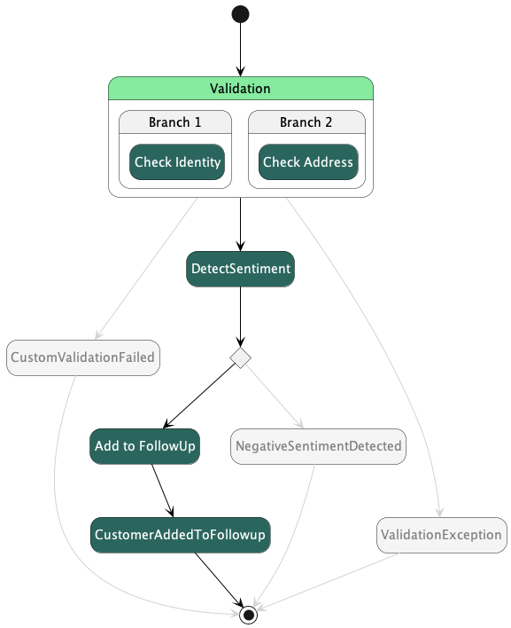
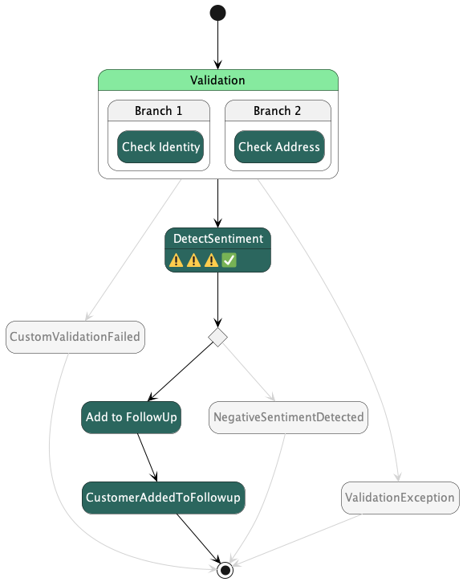
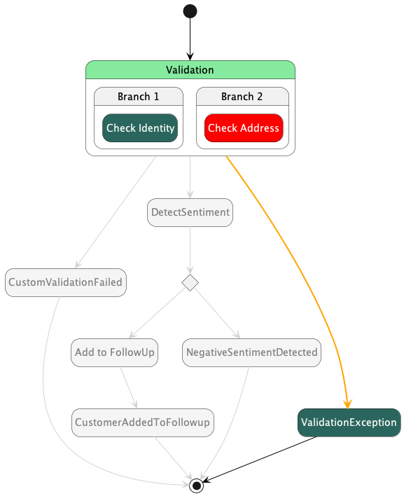

# Sample Application

This project provides a sample step function and MockConfigFile ported from the AWS samples repo. 

| File                      | Description                                   |
|---------------------------|-----------------------------------------------|
| .asl-puml                 | PlantUML diagrams of test runs                |
| \_\_snapshots__           | Standard jest style snapshots for task inputs |
| crm-comment.asl.json      | Step Function in ASL JSON                     |
| crm-comment.asl.test.json | Unit test generated from the MockConfig       |
| crm-comment.mock.ts       | MockConfig type for the tests                 |

## Step Function

- sourced from the AWS step function examples project
- includes a parallel activity 
- includes retry logic
- includes custom faults

## MockConfigFile

- ported from the JSON file
- state names and other types added manually

## Diagrams for Execution

The test runner emits a [PUML diagram](https://plantuml.com) for the execution by using the execution history to annotate the states and transitions.

### HappyPathTest

This test has successful mock responses for each of the tasks. The states and transitions that did not execute are a muted gray. The dark green is for successful Task executions while the light green is for successful non-task executions.

### RetryOnServiceExceptionTest

This test shows that the DetectSentiment Task failed the first three times it ran but completed successfully on the fourth execution. 

### ValidationExceptionCatchTest

This test shows that the Check Address state threw an error. The transition from the Validation to the ValidationException state is yellow since it originates from the catch of an exception.

